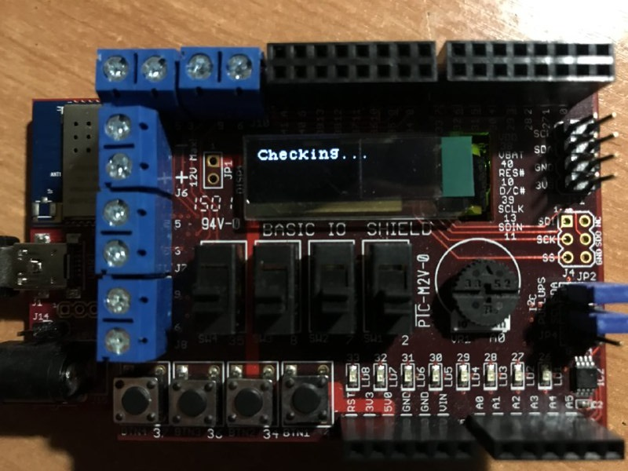

# Build Server Monitor

This device connects to the build server via the Internet and monitors the status of the building of projects in real time. All information is displayed on OLED screen.

The chipKit board is setted up to program it with Arduino IDE. There is a video guide which explains how to do this: [youtube.com/watch?v=DOEdmc57FVU](https://www.youtube.com/watch?v=DOEdmc57FVU).

To compile the sketch you need to install a few additional libraries: [Arduino JSON](ArduinoJSON), [deIPck](https://github.com/sergev/deIPcK) and [IOShieldOled](https://github.com/chipKIT32/thirdpartylibraries).